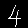

# Using tensorflow-lite.a builds a.out(mnist by tensorflowlite)

**Prerequiesties**  
Ubuntu16.04 Intel CPU with AVX support.  
```
$ lscpu
Architecture:          x86_64
CPU op-mode(s):        32-bit, 64-bit
Byte Order:            Little Endian
CPU(s):                1
On-line CPU(s) list:   0
Thread(s) per core:    1
Core(s) per socket:    1
Socket(s):             1
NUMA node(s):          1
Vendor ID:             GenuineIntel
CPU family:            6
Model:                 94
Model name:            Intel(R) Core(TM) i5-6500 CPU @ 3.20GHz
Stepping:              3
CPU MHz:               3192.000
BogoMIPS:              6384.00
Hypervisor vendor:     KVM
Virtualization type:   full
L1d cache:             32K
L1i cache:             32K
L2 cache:              256K
L3 cache:              6144K
NUMA node0 CPU(s):     0
Flags:                 fpu vme de pse tsc msr pae mce cx8 apic sep mtrr pge mca cmov pat pse36 
clflush mmx fxsr sse sse2 ht syscall nx rdtscp lm constant_tsc rep_good nopl xtopology nonstop_tsc 
cpuid tsc_known_freq pni pclmulqdq monitor ssse3 cx16 pcid sse4_1 sse4_2 x2apic movbe popcnt aes 
xsave avx rdrand hypervisor lahf_lm abm 3dnowprefetch invpcid_single pti fsgsbase avx2 invpcid 
rdseed clflushopt
```

Clone tensorflow.git.  
```
 $ cd
 $ git clone tensorflow/tensorflow
 $ cd tensorflow
 $ ./tensorflow/lite/tools/make/build_lib.sh
 $ ls ./tensorflow/lite/tools/make/gen/linux_x86_64/lib/
   benchmark-lib.a  libtensorflow-lite.a
```

Makes a.out with tensorflow-lite.a.  
```
 # apt install -y libopencv-dev
 $ cd
 $ git clone https://github.com/k5iogura/tensorflowlite-samples
 $ cd tensorflowlite-samples/CNN_NumberDetector/05_TensorflowLite_CPP/
 $ cp ~/tensorflow/tensorflow/lite/tools/make/gen/linux_x86_64/lib/libtensorflow-lite.a .
 $ ./make.sh
 #!/bin/bash -v
  if [ ! -d tensorflow ];then
      echo link tensorflow
      ln -s ~/tensorflow/tensorflow .
  fi
  link tensorflow
  gcc main.cpp -I. -I./tensorflow -I./tensorflow/lite/tools/make/downloads 
  -I./tensorflow/lite/tools/make/downloads/eigen -I./tensorflow/lite/tools/make/downloads/absl 
  -I./tensorflow/lite/tools/make/downloads/gemmlowp -I./tensorlow/lite/tools/make/downloads/neon_2_sse 
  -I./tensorflow/lite/tools/make/downloads/farmhash/src -I./tensorflow/lite/tools/make/downloads/flatbuffers/include 
  -std=c++11 -lstdc++ -ltensorflow-lite -L./ -lm -pthread `pkg-config --libs opencv`
  pkg-config --libs opencv
 $ file a.out
   a.out: ELF 64-bit LSB executable, x86-64, version 1 (GNU/Linux), dynamically linked, interpreter /lib64/l, 
   for GNU/Linux 2.6.32, BuildID[sha1]=67e1936131c250d06045da1ed67b95f6c87c8ad5, not strippe
```

Run a.out for resource/4.png.  
```
INFO: Initialized TensorFlow Lite runtime.
=== Pre-invoke Interpreter State ===
Interpreter has 15 tensors and 5 nodes
Inputs: 10
Outputs: 8

Tensor   0 conv2d_1/Conv2D_bias kTfLiteFloat32   kTfLiteMmapRo         32 bytes ( 0.0 MB)  8
Tensor   1 conv2d_1/Relu        kTfLiteFloat32  kTfLiteArenaRw      25088 bytes ( 0.0 MB)  1 28 28 8
Tensor   2 conv2d_1/kernel      kTfLiteFloat32   kTfLiteMmapRo        288 bytes ( 0.0 MB)  1 3 3 8
Tensor   3 conv2d_2/Conv2D_bias kTfLiteFloat32   kTfLiteMmapRo         16 bytes ( 0.0 MB)  4
Tensor   4 conv2d_2/Relu        kTfLiteFloat32  kTfLiteArenaRw       3136 bytes ( 0.0 MB)  1 14 14 4
Tensor   5 conv2d_2/kernel      kTfLiteFloat32   kTfLiteMmapRo       1152 bytes ( 0.0 MB)  4 3 3 8
Tensor   6 dense_1/BiasAdd      kTfLiteFloat32  kTfLiteArenaRw         40 bytes ( 0.0 MB)  1 10
Tensor   7 dense_1/MatMul_bias  kTfLiteFloat32   kTfLiteMmapRo         40 bytes ( 0.0 MB)  10
Tensor   8 dense_1/Softmax      kTfLiteFloat32  kTfLiteArenaRw         40 bytes ( 0.0 MB)  1 10
Tensor   9 dense_1/kernel/transpose kTfLiteFloat32   kTfLiteMmapRo      31360 bytes ( 0.0 MB)  10 784
Tensor  10 input_1              kTfLiteFloat32  kTfLiteArenaRw       3136 bytes ( 0.0 MB)  1 28 28 1
Tensor  11 max_pooling2d_1/MaxPool kTfLiteFloat32  kTfLiteArenaRw       6272 bytes ( 0.0 MB)  1 14 14 8
Tensor  12 (null)               kTfLiteNoType  kTfLiteMemNone          0 bytes ( 0.0 MB)  (null)
Tensor  13 (null)               kTfLiteNoType  kTfLiteMemNone          0 bytes ( 0.0 MB)  (null)
Tensor  14 (null)               kTfLiteFloat32 kTfLiteArenaRwPersistent       1152 bytes ( 0.0 MB)  72 4

Node   0 Operator Builtin Code   4
  Inputs: 10 2 0
  Outputs: 1
Node   1 Operator Builtin Code  17
  Inputs: 1
  Outputs: 11
Node   2 Operator Builtin Code   3
  Inputs: 11 5 3
  Outputs: 4
Node   3 Operator Builtin Code   9
  Inputs: 4 9 7
  Outputs: 6
Node   4 Operator Builtin Code  25
  Inputs: 6
  Outputs: 8


=== Post-invoke Interpreter State ===
Interpreter has 15 tensors and 5 nodes
Inputs: 10
Outputs: 8

Tensor   0 conv2d_1/Conv2D_bias kTfLiteFloat32   kTfLiteMmapRo         32 bytes ( 0.0 MB)  8
Tensor   1 conv2d_1/Relu        kTfLiteFloat32  kTfLiteArenaRw      25088 bytes ( 0.0 MB)  1 28 28 8
Tensor   2 conv2d_1/kernel      kTfLiteFloat32   kTfLiteMmapRo        288 bytes ( 0.0 MB)  1 3 3 8
Tensor   3 conv2d_2/Conv2D_bias kTfLiteFloat32   kTfLiteMmapRo         16 bytes ( 0.0 MB)  4
Tensor   4 conv2d_2/Relu        kTfLiteFloat32  kTfLiteArenaRw       3136 bytes ( 0.0 MB)  1 14 14 4
Tensor   5 conv2d_2/kernel      kTfLiteFloat32   kTfLiteMmapRo       1152 bytes ( 0.0 MB)  4 3 3 8
Tensor   6 dense_1/BiasAdd      kTfLiteFloat32  kTfLiteArenaRw         40 bytes ( 0.0 MB)  1 10
Tensor   7 dense_1/MatMul_bias  kTfLiteFloat32   kTfLiteMmapRo         40 bytes ( 0.0 MB)  10
Tensor   8 dense_1/Softmax      kTfLiteFloat32  kTfLiteArenaRw         40 bytes ( 0.0 MB)  1 10
Tensor   9 dense_1/kernel/transpose kTfLiteFloat32   kTfLiteMmapRo      31360 bytes ( 0.0 MB)  10 784
Tensor  10 input_1              kTfLiteFloat32  kTfLiteArenaRw       3136 bytes ( 0.0 MB)  1 28 28 1
Tensor  11 max_pooling2d_1/MaxPool kTfLiteFloat32  kTfLiteArenaRw       6272 bytes ( 0.0 MB)  1 14 14 8
Tensor  12 (null)               kTfLiteNoType  kTfLiteMemNone          0 bytes ( 0.0 MB)  (null)
Tensor  13 (null)               kTfLiteNoType  kTfLiteMemNone          0 bytes ( 0.0 MB)  (null)
Tensor  14 (null)               kTfLiteFloat32 kTfLiteArenaRwPersistent       1152 bytes ( 0.0 MB)  72 4

Node   0 Operator Builtin Code   4
  Inputs: 10 2 0
  Outputs: 1
Node   1 Operator Builtin Code  17
  Inputs: 1
  Outputs: 11
Node   2 Operator Builtin Code   3
  Inputs: 11 5 3
  Outputs: 4
Node   3 Operator Builtin Code   9
  Inputs: 4 9 7
  Outputs: 6
Node   4 Operator Builtin Code  25
  Inputs: 6
  Outputs: 8
prob of 0: 0.000
prob of 1: 0.001
prob of 2: 0.013
prob of 3: 0.043
prob of 4: 0.929
prob of 5: 0.003
prob of 6: 0.001
prob of 7: 0.006
prob of 8: 0.001
prob of 9: 0.003
```
 input  
  

**July.19,2019**

