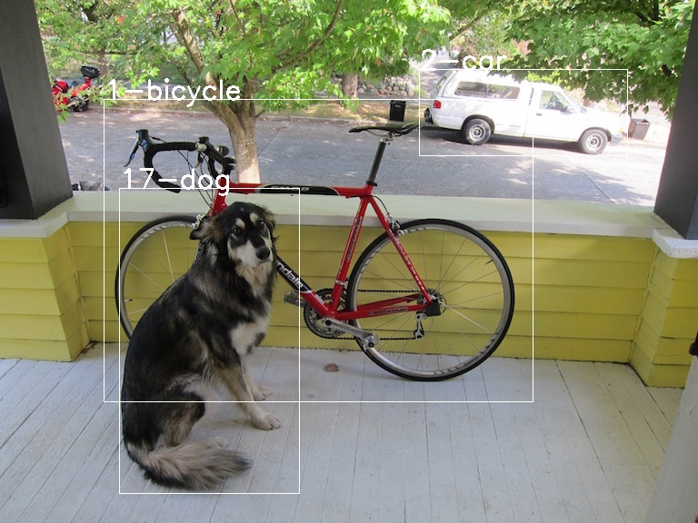

# tensorflowlite-samples

## [To json from tflite with flatbuffers](./README_flatbuffers.md)  
## On rock64 requesries
python-pip python3pip  
pip setuptools  
apt pyhon-dev python3-dev  
apt libhdf5-dev  
ln -s /usr/include/hdf5/serial/\*.h /usr/include/  
ln -s /usr/lib/aarch  
apt wheel
python setup.py dbist_wheel

Reference  
[初心者に優しくないTensorflow Lite の公式サンプル](https://qiita.com/yohachi/items/434f0da356161e82c242)  
[Object Detection](https://www.tensorflow.org/lite/models/object_detection/overview)  

## tensorflowlite  
On CentOS7.5 install python3, tensorflow-gpu and opencv.  
python3  
```
 # yum install -y https://centos7.iuscommunity.org/ius-release.rpm
 # yum install -y python35u python35u-libs python35u-devel python35u-pip
 # cd /usr/bin;ln -s python3.5m python3
```

tensorflowlite(import tensorflow.lite) is includes in since version 1.14.  
tensorflow greater than version 1.6 requires AVX instruction, so not supported Celeron CPU.  
tensorflowlite is included in tensorflow version greater than 1.13.  
tensorflow and opencv  
```
 # python3 -m pip install tensorflow-gpu  
 # python3 -m pip install opencv-python  
 
 $ python3 -c "import tensorflow"
 $
 $ python3 -c "import cv2"
 $
```

## Download tflite and labels  

Goto [Object Detection](https://www.tensorflow.org/lite/models/object_detection/overview) and find sample model zip. As of now zip is coco_ssd_mobilenet_v1_1.0_quant_2018_06_29.zip.  
```
 $ wget http://storage.googleapis.com/download.tensorflow.org/models/tflite/coco_ssd_mobilenet_v1_1.0_quant_2018_06_29.zip
 $ unzip coco_ssd_mobilenet_v1_1.0_quant_2018_06_29.zip
 $ ls
   coco_ssd_mobilenet_v1_1.0_quant_2018_06_29.zip detect.tflite labelmap.txt
```
- detect.tflite : includes weights and network  
- labelmap.txt  : includes detectable object labels(But top 1 line ??? may be unnessesary)  

## Run inference  

```
 $ python3 dog_detect.py
 $
   INFO: Initialized TensorFlow Lite runtime.
   7.386FPS
 $ eog result.jpg
```

Shows result of Interpreter.get_tensor(index).  
**index** : Interpreter.get_output_details()[0]['index']  

|index     |Name                  |Description   |
|-         |-                     |-             |
|+0        |Locations             |Multidimensional array of [10][4] floating point values between 0 and 1, the inner arrays representing bounding boxes in the form [top, left, bottom, right] |
|+1        |Classes               |Array of 10 integers (output as floating point values) each indicating the index of a class label from the labels file |
|+2        |Scores                |Array of 10 floating point values between 0 and 1 representing probability that a class was detected |
|+3        |Number and detections |Array of length 1 containing a floating point value expressing the total number of detection results |


**Locations = Interpreter.get_tensor(index+0)**  
**Classes   = Interpreter.get_tensor(index+1)**  
**Scores    = Interpreter.get_tensor(index+2)**  
**Number and detections = Interpreter.get_tensor(index+3)**  

  

**July.07,2019**  

